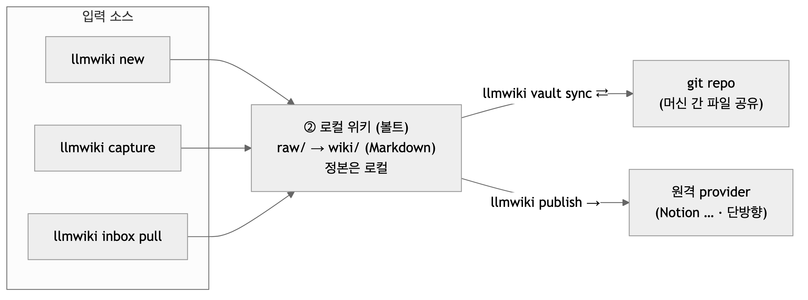

# llm-wiki

여러 개의 LLM 운영 Markdown 위키(볼트)를 하나의 CLI에서 관리하는 경량 라우터입니다. Claude Code와 Codex를 지원하며, 볼트마다 Git 저장소·운영 규칙·보안 경계를 분리한 채 지식을 추가하고 검색하고 활용할 수 있습니다.

로컬 Markdown을 정본으로 유지하면서 Git으로 여러 머신에 동기화하고, 필요하면 Notion 같은 원격 저장소에 읽기 좋은 view로 발행합니다.



## 주요 기능

- **통합 진입점** — 어느 디렉터리에서든 `llmwiki`를 실행해 등록된 모든 볼트를 사용합니다.
- **자동 라우팅** — 주제와 라우팅 신호를 바탕으로 적절한 볼트를 선택합니다.
- **Claude Code와 Codex 지원** — 같은 볼트와 워크플로우를 두 에이전트에서 사용합니다.
- **로컬 우선** — Markdown이 항상 정본이며, Git backend로 여러 머신에서 이어서 작업할 수 있습니다.
- **선택적 원격 발행** — 현재 Notion provider를 통해 로컬 위키를 단방향으로 발행하고 inbox를 가져올 수 있습니다.

## 요구사항

- Node.js 18 이상
- Claude Code 또는 Codex 중 하나 이상
- Git backend를 사용할 경우 Git

## 설치

```bash
npm install -g github:Aiden-Jeon/llm-wiki
```

소스에서 설치하려면:

```bash
git clone https://github.com/Aiden-Jeon/llm-wiki.git
cd llm-wiki
npm install
npm link
```

## 빠른 시작

### 1. 초기 설정

```bash
llmwiki setup
```

대화형 안내에 따라 첫 번째 로컬 볼트를 등록합니다. 기존 Git 저장소를 볼트로 사용하거나 상세 옵션을 지정하려면 [설정 가이드](docs/configuration.md)를 참고하세요.

### 2. 에이전트 시작

```bash
llmwiki          # 설치된 Claude Code 또는 Codex 자동 선택
llmwiki claude   # Claude Code로 시작
llmwiki codex    # Codex로 시작
```

### 3. 지식 추가와 검색

Claude Code에서는 슬래시 명령으로 호출합니다.

```text
/wiki-add https://arxiv.org/abs/2501.12345
/wiki-search LLM 서빙 비용 최적화
/wiki-use 이 자료들을 바탕으로 비용 절감안을 정리해줘
```

Codex에서는 태스크 이름을 그대로 말합니다.

```text
wiki-add ~/Downloads/meeting-notes.md
wiki-search LLM 서빙 비용 최적화
wiki-use 관련 지식을 종합해서 설명해줘
```

에이전트는 등록된 볼트와 주제 신호를 확인해 대상을 정합니다. 대상이 모호하거나 보안 확인이 필요하면 실행 전에 질문합니다.

## 자주 쓰는 작업

터미널에서 바로 자료를 넣거나 볼트를 관리할 수도 있습니다.

```bash
# URL·파일·텍스트 ingest 세션 시작
llmwiki new https://arxiv.org/abs/2501.12345

# 빠른 메모 저장
echo "회의에서 나온 아이디어" | llmwiki capture --vault personal --title "아이디어"

# Git backend 볼트 동기화
llmwiki vault sync personal

# 설정과 볼트 상태 진단
llmwiki doctor
```

전체 명령과 옵션은 CLI 도움말이 정본입니다.

```bash
llmwiki --help
```

## 원격 발행

Notion 연동은 선택 사항입니다. 볼트를 등록한 뒤 연결과 대상 데이터베이스를 설정하고 발행합니다.

```bash
llmwiki publish add personal
llmwiki publish personal --dry-run
llmwiki publish personal
llmwiki inbox pull personal
```

토큰 저장, 데이터베이스 속성, view, CI 설정은 [원격 발행 가이드](docs/publishing.md)를 참고하세요.

> `llmwiki vault sync`는 Markdown 원본을 Git으로 공유하고, `llmwiki publish`는 위키 view를 원격 provider에 발행합니다. 두 기능은 서로 독립적입니다.

## 보안

볼트는 `open` 또는 `secure`로 등록합니다. `secure` 볼트에 쓰거나 외부로 발행할 때는 사용자 확인과 익명화 절차가 적용됩니다.

`secure`는 에이전트 라우팅 정책이며 암호화 기능이 아닙니다. 파일 권한, 디스크 암호화, 원격 저장소 접근 제어는 별도로 설정해야 합니다.

## 문서

- [설정 가이드](docs/configuration.md) — 볼트, Git backend, 환경 변수, 설정 이전
- [원격 발행 가이드](docs/publishing.md) — Notion publish/inbox, 연결과 토큰, 상태 관리
- [아키텍처](docs/architecture.md) — 라우터와 볼트 구조, 스키마, provider 확장
- [에이전트 라우팅 규칙](WIKI-CLI.md) — 에이전트 세션에서 적용되는 운영 규칙

## 개발

```bash
npm test
npm pack --dry-run
```

## 라이선스

MIT
